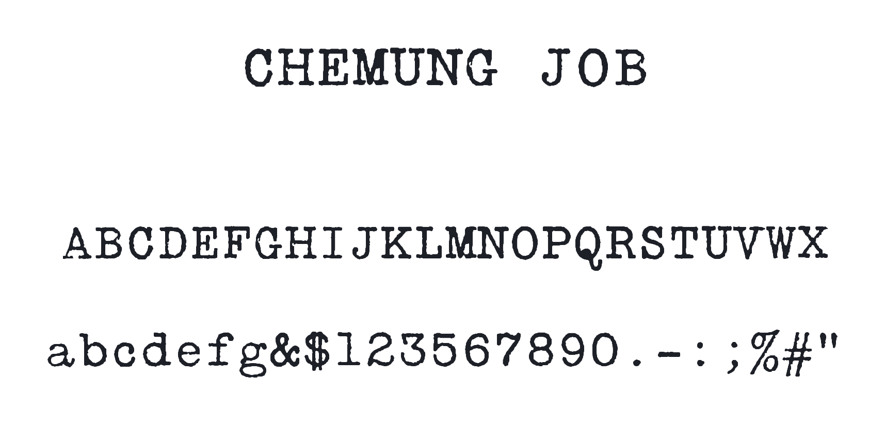
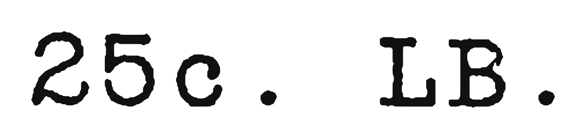

# Chemung Job

<p align="center">
  
</p>

<p align="center">
  
</p>

A monospaced slab serif face traced from a printed 12 point specimen sheet of
type and borders manufactured by the Monotype and sold by the Chemung Printing
Company of Elmira, N.Y. The source is a partial showing, so the face has only
the characters that specimen printed.

## Download

The fonts live in the [`fonts/`](fonts) folder of this repository. Click a file
below, then use the **Download raw file** button on GitHub to save it.

| File | Use |
| --- | --- |
| [ChemungJob-Regular.otf](fonts/ChemungJob-Regular.otf) | Desktop (OpenType) |
| [ChemungJob-Regular.ttf](fonts/ChemungJob-Regular.ttf) | Desktop (TrueType) |
| [ChemungJob-Regular.woff2](fonts/ChemungJob-Regular.woff2) | Web (preferred) |
| [ChemungJob-Regular.woff](fonts/ChemungJob-Regular.woff) | Web (fallback) |

To grab everything at once, download the whole repository with the green
**Code** button above and choose **Download ZIP**. Tagged release ZIPs are also
on the [Releases](../../releases) page.

To install on your computer, open the `.otf` (or `.ttf`) file and click
**Install**.

## Character set

This is a partial font. It has the 49 characters the source specimen showed,
plus a space, for 50 encoded in all:

* Capitals A to X only, with no Y or Z
* Lowercase a to g only
* Figures 0 to 9 except 4
* The symbols ampersand, dollar, period, colon, semicolon, percent, number
  sign, straight double quote, and the hyphen
* A space, which the specimen sheet did not show, advancing 600 units like
  every other cell

Any character the font does not contain types as a blank space, because the
notdef glyph is empty rather than a missing glyph box.

## Metrics

* Monospaced. Every glyph advances 600 units and the font is flagged fixed
  pitch in post (isFixedPitch), in OS/2 PANOSE (Monospaced), and in CFF.
* 1000 units per em, derived from a 12 point body at 10 characters per inch.
* Baseline, cap height and lowercase are taken from the specimen as scanned,
  and glyphs are centered in their cells.

## Web use

Self-host the web files and point `@font-face` at them:

```css
@font-face {
  font-family: "Chemung Job";
  src: url("ChemungJob-Regular.woff2") format("woff2"),
       url("ChemungJob-Regular.woff")  format("woff");
  font-weight: normal;
  font-style: normal;
}
```

## License

Copyright 2026 Michael Seh (https://michaelsfonts.com), with Reserved Font
Name "Chemung Job". Licensed under the SIL Open Font License, Version 1.1. The
full text is in OFL.txt and the FAQ is at https://openfontlicense.org. The
fonts may be used, studied, modified and redistributed freely, but may not be
sold by themselves.